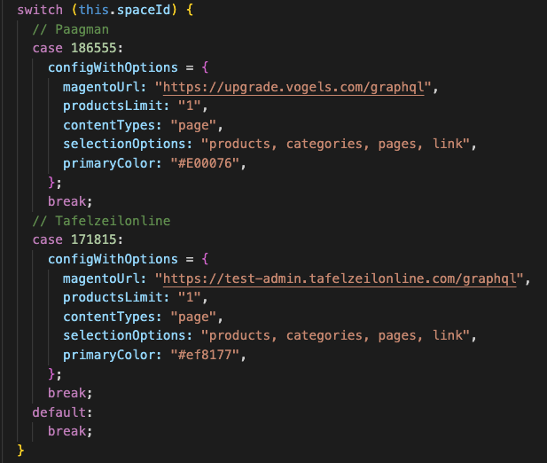
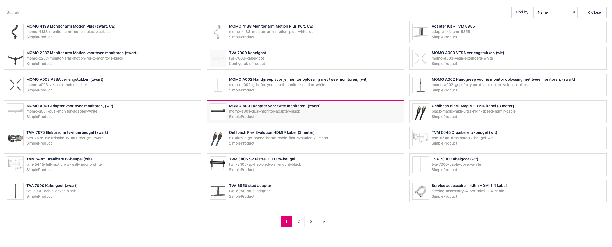
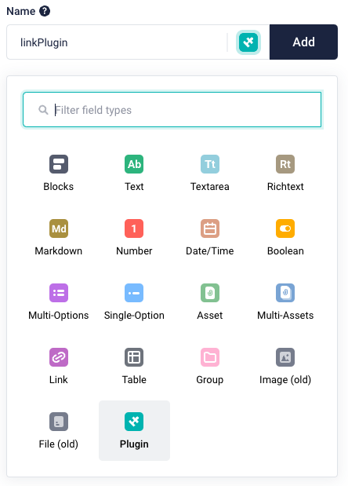
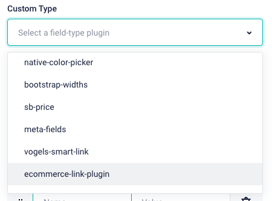
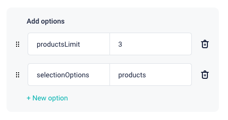
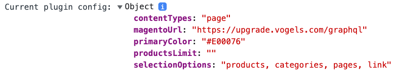

# Storyblok - Ecommerce link plugin

> A Storyblok Field-Type Plugin to fetch products, categories, storyblok pages and set an external link.

## Pre-requisites

- Node 14.x.x
- Vue CLI service 3.12.1
- Webpack 4.46.0

## Project setup

```
npm install
```

### Compiles and hot-reloads for development

```
npm run serve
```

### Compiles and minifies for production

```
npm run build
```

### Lints and fixes files

```
npm run lint
```

## Plugin configuration

Every Storyblok space should have a basic config for the linkPlugin to work (see image below). You can copy the examples for Paagman / TZO and add them to the switch case. Your spaceId is logged to your console or you can find it next to the space in the field type editor. These setting are the default and can be overwritten in every component where you use the plugin.



| Property         | Description                                                                          |
| ---------------- | ------------------------------------------------------------------------------------ |
| magentoUrl       | The URL that will be used to fetch the products & categories                         |
| productsLimit    | The maximum amount of products that can be selected.                                 |
| contentTypes     | The contentTypes that can be fetched from the Storyblok API (e.g. CmsPage, BlogPost) |
| selectionOptions | The options the user can select from the dropdown.                                   |
| primaryColor     | The primaryColor so the linkPlugin has the some colors as the website                |

Once you've added your configuration you should push it to the git repositiory so we all have the latest version of the plugin. After that you can use `npm run build` and paste the code from /dist/export.js in the field-type-plugin editor. Once you've done that and select products from the dropdown you should see some products like below.



## Plugin usage

Whenever you want to use the linkPlugin in a component add a field to the schema and select Plugin.



Under "Custom Type" dropdown select "ecommerce-link-plugin".



Under that you can add options. these options will overwrite the config in the plugin code. For example :



This will let the user of the component select a maximum of 3 items and it will only show the option to select products. You can see the options you can overwrite in your console :



## Plugin UI

### Delete an item

Either click on a already selected item in the modal or click the trashcan next to the image

### Reposition items

You can drag and drop the items to reposition them

## Data output

## Multiple products:

If you select multiple products the products will be added to the `items` property

| Property | type      | Description                                                                     |
| -------- | --------- | ------------------------------------------------------------------------------- |
| id       | string    | Attribute uid in the query                                                      |
| name     | string    | Attribute name in the query                                                     |
| url      | string    | Attribute url_key in the query                                                  |
| sku      | string    | The sku of the product                                                          |
| typename | string    | Attribute \_\_typename in the query (e.g.) Configurable product / SimpleProduct |
| type     | "product" | The type to determine the what the item is in this case `product`               |

## Single product:

If you select a single product it will be added to the `item` property

| Property | type      | Description                                                                     |
| -------- | --------- | ------------------------------------------------------------------------------- |
| id       | string    | Attribute uid in the query                                                      |
| name     | string    | Attribute name in the query                                                     |
| url      | string    | Attribute url_key in the query                                                  |
| sku      | string    | The sku of the product                                                          |
| typename | string    | Attribute \_\_typename in the query (e.g.) Configurable product / SimpleProduct |
| type     | "product" | The type to determine the what the item is in this case `product`               |

## Category:

If you select a category it will be added to the `item` property

| Property | type       | Description                                                        |
| -------- | ---------- | ------------------------------------------------------------------ |
| id       | string     | Attribute uid in the query                                         |
| name     | string     | Attribute name in the query                                        |
| url      | string     | Attribute url_key in the query                                     |
| type     | "category" | The type to determine the what the item is in this case `category` |

## Page:

If you select a page it will be added to the `item` property

| Property | type   | Description                                                    |
| -------- | ------ | -------------------------------------------------------------- |
| id       | string | Attribute uuid in the query                                    |
| name     | string | Attribute name in the query                                    |
| url      | string | Attribute full_slug in the query                               |
| type     | "page" | The type to determine the what the item is in this case `page` |

## External link:

If you select a external link it will be added to the `item` property

| Property     | type    | Description                                                    |
| ------------ | ------- | -------------------------------------------------------------- |
| url          | string  | The url you input from the input field                         |
| openInNewTab | boolean | The value from the radio input                                 |
| type         | "link"  | The type to determine the what the item is in this case `link` |

## Dynamic products

If you select a dynamic product it will be added to the `item` property

| Property    | type               | Description                                                       |
| ----------- | ------------------ | ----------------------------------------------------------------- |
| id          | string             | Attribute value in the query OR category uid in the query         |
| name        | string             | Attribute label OR category name in the query                     |
| filterValue | object             | The filter value to be used in the query on the frontend          |
| type        | "dynamic-products" | The type to determine the what the item is in this case `dynamic` |
